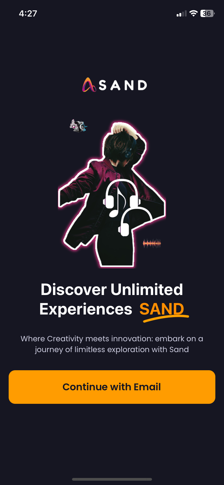
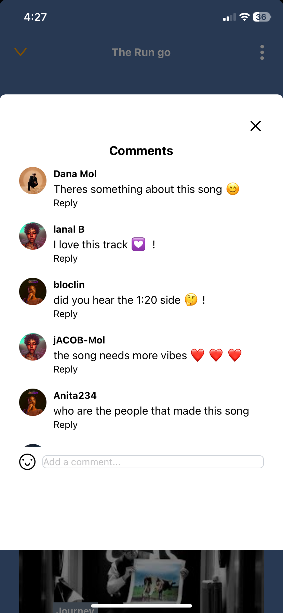
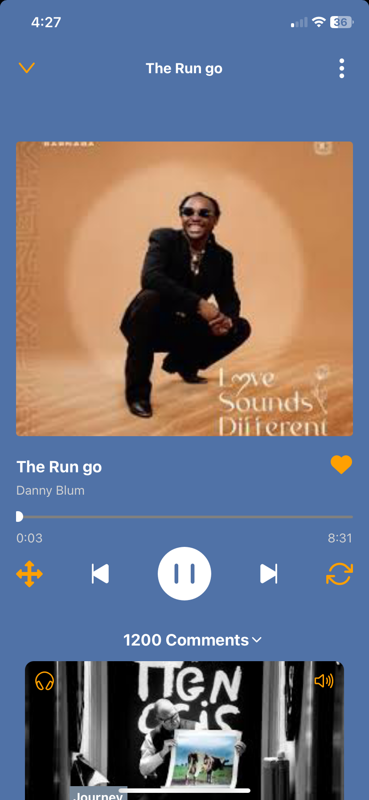
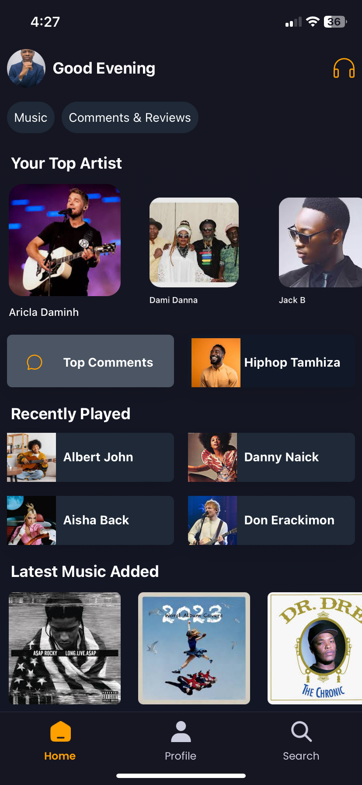
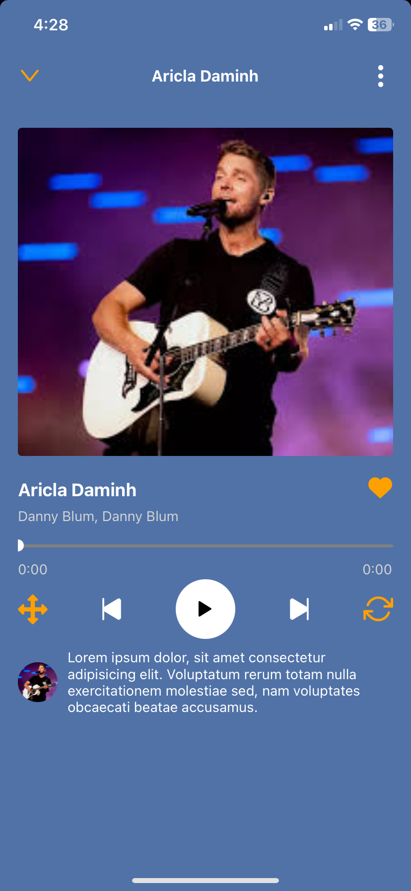
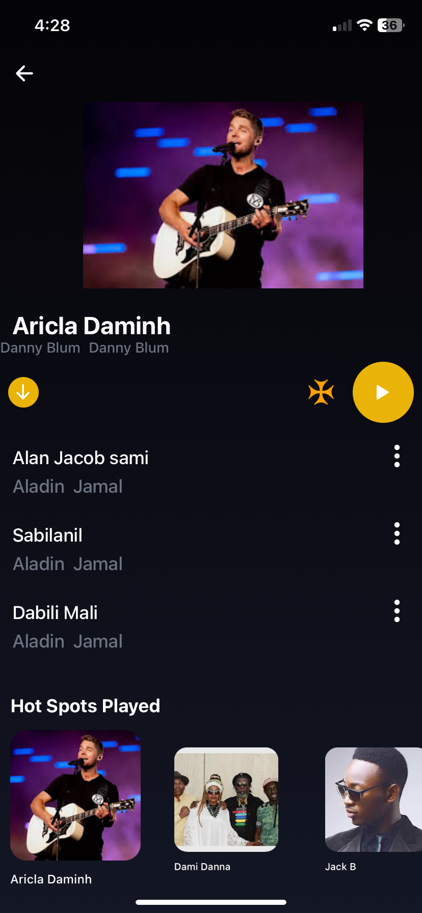
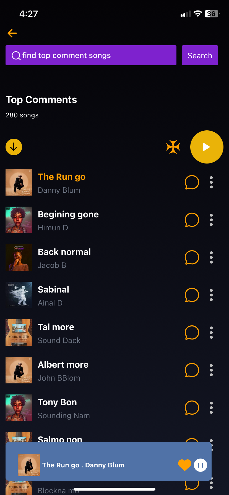
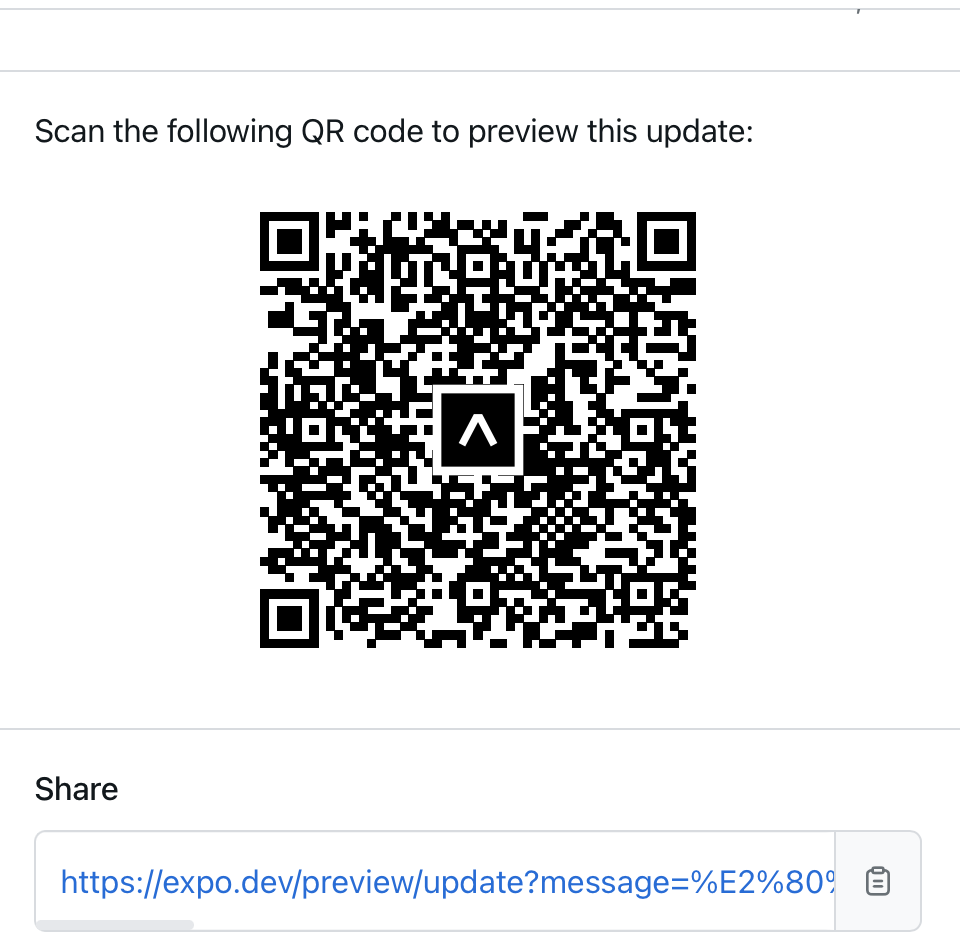

Building a Dynamic Music App with React Native and Expo Go

I recently completed a dynamic music app using dummy data to build the user interface, leveraging the latest versions of React Native and Expo Go. This guide will help other developers implement song playback in their apps using the following dependencies:

"expo-av": "^14.0.5"
"expo-linear-gradient": "^13.0.2"
"expo-linking": "~6.3.1"
"expo-router": "~3.5.16"
"lodash": "^4.17.21"
"nativewind": "^2.0.11"
"react-native-animatable": "^1.4.0"
"react-native-gesture-handler": "~2.16.1"
"react-native-modals": "^0.22.3"
"react-native-reanimated": "~3.10.1"
"react-native-safe-area-context": "4.10.1"
With the help of the latest Expo Go, I brought the app to life, making it accessible for other developers to explore and learn from.

Key Features

Using expo-av for Audio Playback
The expo-av library provides an easy-to-use API for audio playback. Here's a snippet on how to use it to load and play a song:







import { Audio } from "expo-av";

const handlePlayButtonPress = async () => {
  const { sound } = await Audio.Sound.createAsync(
    { uri: "https://example.com/song.mp3" },
    { shouldPlay: true }
  );
  setSound(sound);
};

Implementing Gradients with expo-linear-gradient

Add beautiful gradients to your app using expo-linear-gradient:


import { LinearGradient } from "expo-linear-gradient";

return (
  <LinearGradient colors={["#040306", "#131624"]} style={{ flex: 1 }}>
    {/* Your content goes here */}
  </LinearGradient>
);


Navigation with expo-router
Use expo-router for simple and effective navigation:


import { useRouter } from "expo-router";

const router = useRouter();

const navigateToDetails = (item) => {
  router.push({
    pathname: "/details",
    params: { item: JSON.stringify(item) },
  });
};







FlatList vs. Map for List Rendering

One common issue when using FlatList in React Native is the VirtualizedList error. To avoid this, ensure your data is properly structured and avoid nested FlatList components when possible.


import { FlatList } from "react-native";

const renderItem = ({ item }) => (
  <View>
    <Text>{item.name}</Text>
  </View>
);

return (
  <FlatList
    data={data}
    renderItem={renderItem}
    keyExtractor={(item) => item.id.toString()}
  />
);


Bringing the App to Life with Expo Go

Expo Go allows developers to view and interact with their React Native apps on physical devices without the need for a full development setup. Simply scan the barcode with the Expo Go app on iOS or Android to see the app in action.

Viewing the App

Download Expo Go:


iOS Expo Go



Android Expo Go


Scan the Barcode:

Open the Expo Go app on your device.
Use the camera to scan the QR code provided by Expo.


GitHub Repository

To get the front-end code, visit our GitHub repository. Give us a star, like, and follow for updates. We will soon be posting the web app project and the backend project as well.

markdown
Copy code
- Front-end Code (https://github.com/your-repo-url)
Conclusion

This music app provides a comprehensive guide on building a functional and visually appealing music player using React Native and Expo. By following the steps and utilizing the libraries mentioned, you can create a dynamic music app that offers a seamless user experience. Stay tuned for updates on the web app and backend implementation.

Happy coding!


# Welcome to your Expo app 👋

This is an [Expo](https://expo.dev) project created with [`create-expo-app`](https://www.npmjs.com/package/create-expo-app).

## Get started

1. Install dependencies

   ```bash
   npm install
   ```

2. Start the app

   ```bash
    npx expo start
   ```

In the output, you'll find options to open the app in a

- [development build](https://docs.expo.dev/develop/development-builds/introduction/)
- [Android emulator](https://docs.expo.dev/workflow/android-studio-emulator/)
- [iOS simulator](https://docs.expo.dev/workflow/ios-simulator/)
- [Expo Go](https://expo.dev/go), a limited sandbox for trying out app development with Expo

You can start developing by editing the files inside the **app** directory. This project uses [file-based routing](https://docs.expo.dev/router/introduction).

## Get a fresh project

When you're ready, run:

```bash
npm run reset-project
```

This command will move the starter code to the **app-example** directory and create a blank **app** directory where you can start developing.

## Learn more

To learn more about developing your project with Expo, look at the following resources:

- [Expo documentation](https://docs.expo.dev/): Learn fundamentals, or go into advanced topics with our [guides](https://docs.expo.dev/guides).
- [Learn Expo tutorial](https://docs.expo.dev/tutorial/introduction/): Follow a step-by-step tutorial where you'll create a project that runs on Android, iOS, and the web.

## Join the community

Join our community of developers creating universal apps.

- [Expo on GitHub](https://github.com/expo/expo): View our open source platform and contribute.
- [Discord community](https://chat.expo.dev): Chat with Expo users and ask questions.
